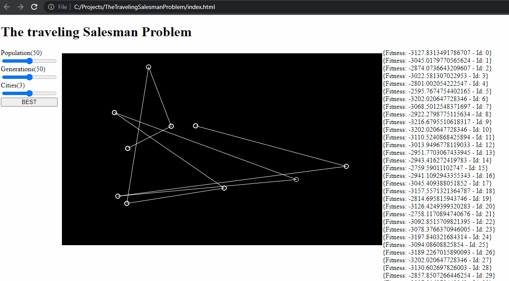

# The Travelling Salesman Problem
A [Genetic Algorithm](https://en.wikipedia.org/wiki/Genetic_algorithm) approach for solving the Travelling Salesman Problem.

> Given a list of cities and the distances between each pair of cities, what is the shortest possible route that visits each city exactly once and returns to the origin city?
> 
> See more on [Wikipedia](https://en.wikipedia.org/wiki/Travelling_salesman_problem)

